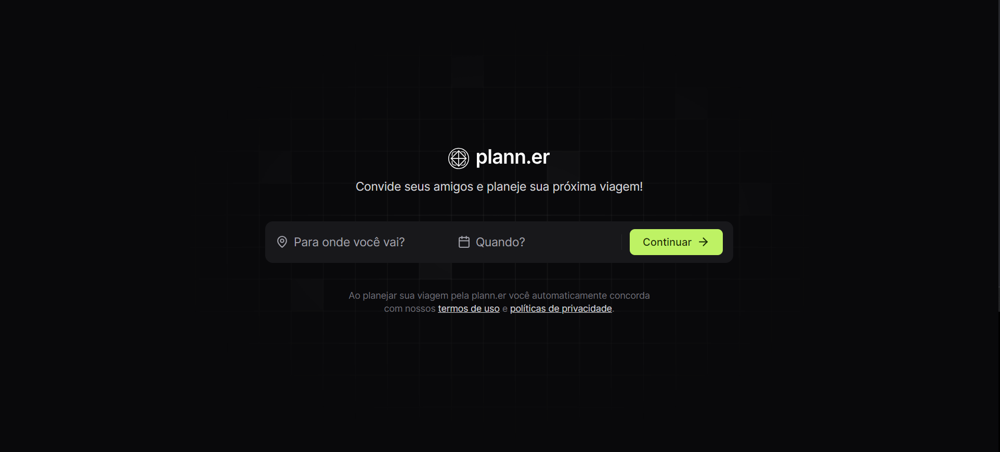
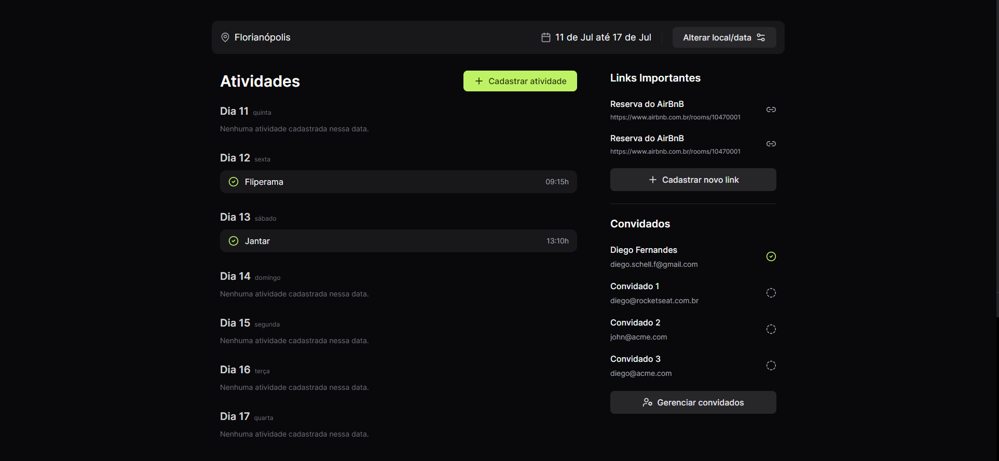

# plann.er

Consiste em um site para a organização de viagens. Feito seguindo o evento da **NLW Journey** da **Rocketseat**.

## Tecnologias

## Funcionalidades

- Criação de uma viagem com destino, data de início e término e convidados
- Adicionar atividades para essa viagem, com data e horário
- Confirmação de convidados via email

## Como executar

- Baixe o projeto em .zip e extraia seus arquivos ou clone ele: `git clone https://github.com/rafaelsantiagosilva/plann.er.git`
- Em cada pasta (_client_ e _server_) rode o comando `npm install` em seu terminal para instalar as dependências do projeto
- Crie um arquivo .env e siga o exemplo (.env.example) para colocar as informações corretamente
- Inicie o servidor backend, a API, através do comando `npm run dev` na pasta _server_
- Inicie o _vite_ com o comando `npm run dev` na pasta _client_